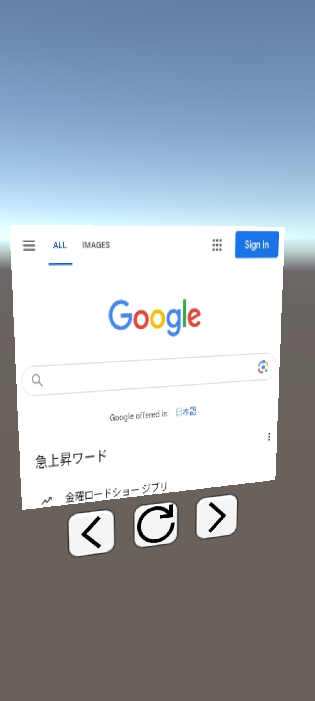
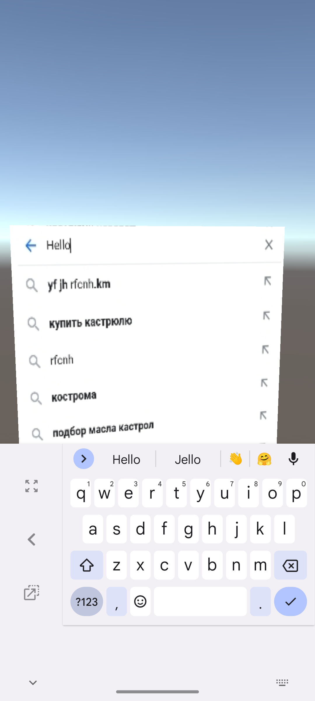
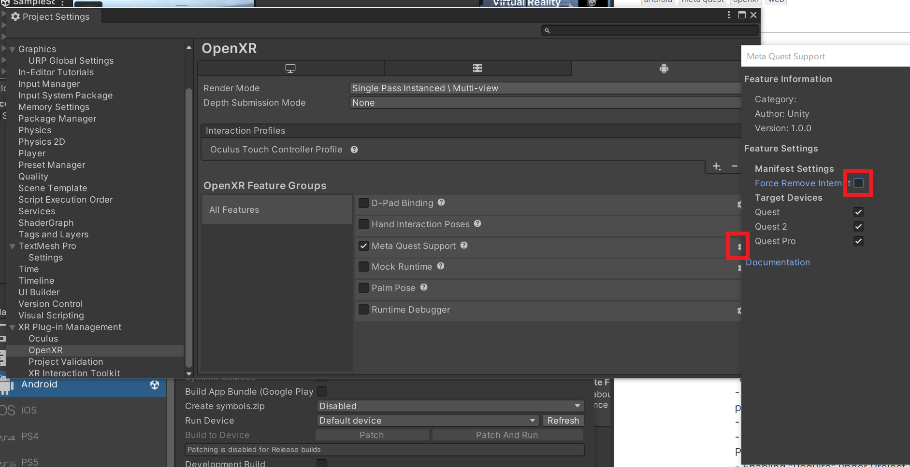

# Simple Unity 3D WebView for Android (or Meta Quest etc.)

Simple Unity 3D WebViewは，UnityのAndroidビルドアプリ上で3D WebViewを表示するためのシンプルなライブラリ.

   

## 導入

1. [パッケージをインストールする](https://docs.unity3d.com/Manual/upm-ui-local.html)．
2. File > Build Settings > PlatformからAndroidを選択し，Switch Platformボタンを押す．
3. Player Settingsボタンを押し，AndroidタブのPublishing Settings > Build > Custom Main Manifestにチェックを入れ，下のパスを確認する.
4. 確認したパスに生成された`AndroidManifest.xml`を開き，以下を変更する．
    - manifestタグ内に，`<uses-permission android:name="android.permission.INTERNET" />`タグを追加する．
    - applicationタグに，`android:networkSecurityConfig="@xml/network_security_config"`と`android:hardwareAccelerated="true"`を追加する
    - activityタグのandroid:nameを`com.t34400.webviewtexture.WebViewUnityPlayerActivity`に変更する．
    - サンプル
        ```xml
        <?xml version="1.0" encoding="utf-8"?>
        <manifest
            xmlns:android="http://schemas.android.com/apk/res/android"
            package="com.unity3d.player"
            xmlns:tools="http://schemas.android.com/tools">
            <uses-permission android:name="android.permission.INTERNET" />
            <application android:networkSecurityConfig="@xml/network_security_config"
                        android:hardwareAccelerated="true">
                <activity android:name="com.t34400.webviewtexture.WebViewUnityPlayerActivity"
                        android:theme="@style/UnityThemeSelector">
                    <intent-filter>
                        <action android:name="android.intent.action.MAIN" />
                        <category android:name="android.intent.category.LAUNCHER" />
                    </intent-filter>
                    <meta-data android:name="unityplayer.UnityActivity" android:value="true" />
                </activity>
            </application>
        </manifest>
        ```

## 使い方

1. 適当な`Canvas`に`RawImage`オブジェクトを作成し，`PointerEventSource`コンポーネントを追加する．
2. 適当なGameObjectに`WebViewBitmapReceiver`コンポーネントを追加し，以下のようにインスペクタを更新する．
    - ImageとPointer Event Sourceに先ほどの`RawImage`をアタッチする．
    - Web View SizeにWebブラウザの画面サイズ(px)を指定する（Webサイトのレイアウトに影響）．
    - Texture Sizeにテクスチャ化されたWebページのサイズ(px)を指定する．
    - Interval Secにテクスチャ更新の最高頻度を指定する．
3. 適当なGameObjectに`WebViewControllerClient`コンポーネントを追加し，以下のようにインスペクタを更新する．
    - Web View Bitmap Receiverに先ほどのGameObjectをアタッチする．
    - Load Urlに初期URLを指定する．
4. デバイスに応じてUIの操作に必要なコンポーネント(XR Interaction Toolkit, Oculus Interaction SDKなど)を追加する．

サンプルプレハブが`Assets/SamplePrefabs`に設置されているので，適宜参照する．

## Webブラウザの操作方法

- RawImageの上でクリック・ドラッグするとタッチ操作できる．
    - その他，デバイスに対応したUI操作コンポーネント(XR Interaction Toolkit, Oculus Interaction SDKなど)を追加すると，それらのUI操作に応じて操作できる．
        - より具体的には，`UnityEngine.EventSystems`名前空間の`IPointerExitHandler`, `IPointerDownHandler`, `IPointerUpHandler`, `IDragHandler`に対応していればよい．
- `WebViewControllerClient`の各種メソッドから，URLの読み込み，リロード，戻る・進む，JavaScriptの実行，画面の更新の開始・停止ができる．
    - `void LoadUrl(string url)`: URLの読み込み
    - `void Reload()`: リロード
    - `void GoBack()`: 戻る
    - `void GoForward()`: 進む
    - `void EvaluateJavascript(string script)`: JavaScriptの実行
    - `void StartUpdate()`: 画面の更新の開始
    - `void StopUpdate()`: 画面の更新の停止


## Webページからの値の取得
- Javascript上で`Android.sendJsonData('タイプ文字列', 'データ文字列')`を呼び出すと，`WebViewBitmapReceiver`の`UnityEvent<string, string> dataReceived`イベントが呼び出される．
    - イベントの引数は，`Android.sendJsonData('タイプ文字列', 'データ文字列')`で送ったそれぞれの引数である．
    - イベントの処理を行うコンポーネントに，`public void DoSomething(string type, string dataString)`という形式のメソッドを定義すると，`WebViewBitmapReceiver`のインスペクタから`dataReceived`のリスナとして登録できる．
    - サンプル:
        ```c#
        using UnityEngine;
        using WebView;

        public class TestComponent : MonoBehaviour
        {
            private const string MY_SCRIPT = 
                "const data = { id: 100, name: 't34400' };" +
                "try {" +
                "   const dataJson = JSON.stringify(data);" +
                "   Android.sendJsonData('YOUR_TYPE', dataJson);" + 
                "} catch(e) {" +
                "   console.error(e.message);" +
                "}";
            
            [SerializeField] private WebViewControllerClient webViewControllerClient;

            // 受け取ったデータの処理（このメソッドを`WebViewBitmapReceiver`のインスペクタに登録する）
            public void DataReceived(string type, string data)
            {
                if(type.Equals("YOUR_TYPE"))
                {
                    var idNameData = JsonUtility.FromJson<IdNameData>(data);
                    Debug.Log($"ID: {idNameData.id}, Name: {idNameData.name}");
                }
            }

            private void Update()
            {
                // Javascript上でAndroid.sendJsonData()を呼び出し
                webViewControllerClient.EvaluateJavascript(MY_SCRIPT);
            }

            [System.Serializable]
            public struct IdNameData
            {
                public int id;
                public string name;
            }
        }
        ```

## 非SSL接続で使えない特定のAPIを有効にする

1. `Assets/Plugins/Android/res.androidlib/res/xml/network_security_config.xml`を開く(UnityEditor上では表示できないので，他の方法で開く)
2. <domain-config>タグに`<domain includeSubdomains="true">[ホスト名]</domain>`を追加する．
    - デフォルトでは，localhostのみこの機能を有効化してある．

## 注意
- AndroidのネイティブからUnityへのWebViewテクスチャ渡しはシンプルにCPUで行っているため，テクスチャサイズが大きかったり更新頻度が早すぎると処理が重くなる可能性がある．
- キーボードの文字入力については，inputタグとtextareaタグについては対応しているが，やや不安定．
- AndroidのNative側からのメッセージはWebViewBitmapReceiverがアタッチされているGameObject名を対象に送信されるため，シーンの他のオブジェクトと異なる名前にすること．
    - 同じシーンに複数のWebViewを配置する場合は，それぞれ別の名前にすること
- OpenXRを使用している場合は，`Project Settings` > `OpenXR` > `Meta Quest Support`の`Force Remove Internet`のチェックを外す.
    - Unity OpenXR 1.9.1以前のバージョンではこのチェックが外れていてもインターネット権限を削除する不具合が存在するため，`Packages/manifest.json`のOpenXRのバージョンを1.9.1にするか，ビルド時にPost gradleを使ってOpenXRが権限を削除した後に再度Manifestに追加する．

- Meta Quest上で使用する場合は，`AndroidManifest.xml`に以下のpermissionを追加する．
  
   ```xml
   <uses-feature android:name="oculus.software.overlay_keyboard" 
                 android:required="true" />
   ```

## ライセンス
[MITライセンス](./LICENSE)

## 謝辞

サンプルプレハブのボタンアイコンは、[Evericons](http://evericons.com)よりCC0 1.0 Universalライセンスのもとでお借りしています．Evericonsのご厚意に感謝申し上げます．